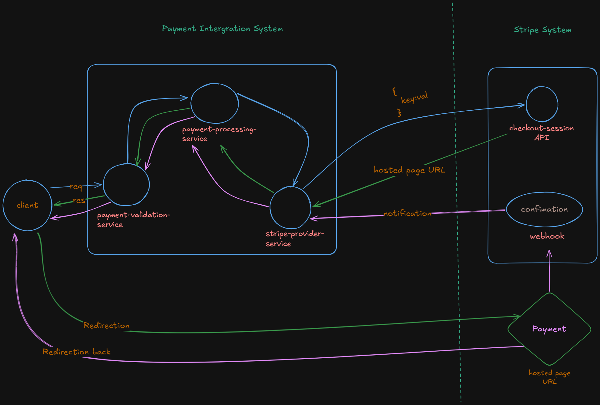

# 💳 Payment Integration System
A secure, scalable, and modular Stripe Payment Integration System built using Java Spring Boot following a microservices architecture. The system is designed to handle payment processing, validation, security, and notification workflows with production-level practices.

## 🚀 Key Features
- 🔐 Secure API communication using HmacSHA256 & Basic Authentication


- 💳 Stripe PSP integration (Create, Retrieve, Expire Session)


- 🧩 Microservices architecture with decoupled services


- ⚙️ Modular validation framework for flexible rule management


- ⚡ Redis caching for business rule optimization


- 📩 Stripe webhook/notification handling


- 🛡️ Robust error handling with custom error codes


- 📊 RESTful API design with industry standards


## 🧩 Microservices Overview
### 🔐 Payment Validation Service
#### Handles:
- Request validation framework


- Business rules processing


- Redis caching of validation parameters


- HMAC-based request authentication


- Duplicate & fraud prevention


### 💳 Stripe Provider Service
#### Handles:
- Stripe API integration


- Create Session


- Retrieve Session


- Expire Session


- Notification event processing


## 🏗️ Architecture
```
         Client
           ↓
Payment Validation Service
           ↓
  Stripe Provider Service
           ↓
      Stripe APIs
           ↓
        Response
```
## Payment Flow


## 🛠️ Teḥch Stack
- Backend: Java, Spring Boot, Spring Security


- Database: MySQL (Spring JDBC)


- Caching: Redis


- Cloud: AWS (EC2, RDS, Secrets Manager)


- Security: HmacSHA256, Basic Auth


- Architecture: Microservices


- Design Patterns: Factory, Builder


## ⚙️ Responsibilities & Contributions
- Implemented Stripe integration using Spring Boot microservices


- Developed stripe-provider and payment-validation services


- Integrated Stripe REST APIs for session lifecycle management


- Designed a modular validation framework for extensibility


- Implemented Redis caching for business rules optimization


- Secured APIs using HmacSHA256 & Spring Security


- Built robust error handling & custom exception framework


- Processed Stripe notification events


- Worked with MySQL (Spring JDBC) for data persistence


- Deployed and tested on AWS (EC2, RDS, Secrets Manager)


- Applied OOP principles & design patterns for maintainability


## 🧪 Testing & Debugging
- Unit testing for service layers


- Debugging API workflows and integration issues


- Validation of edge cases and failure scenarios


## 🎯 Learning Outcomes
- Hands-on experience with payment gateway integration


- Strong understanding of microservices architecture


- Practical exposure to security mechanisms in APIs


- Improved debugging, design thinking, and problem-solving skills

